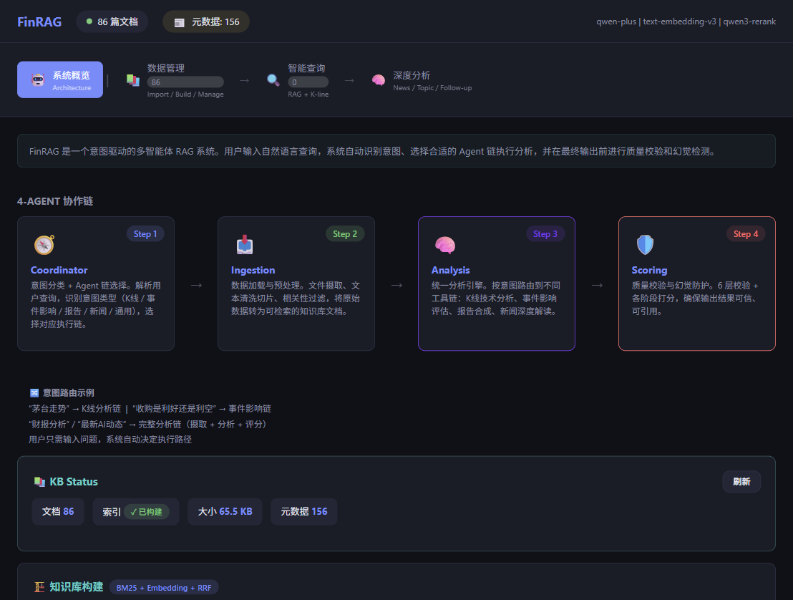
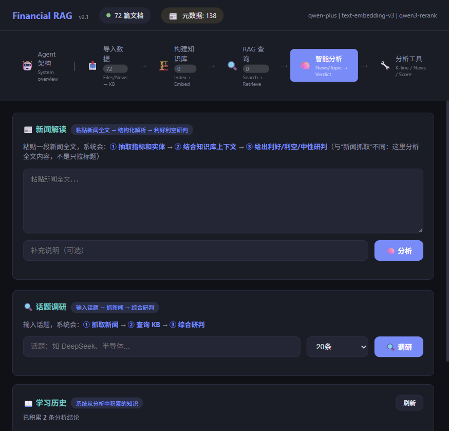
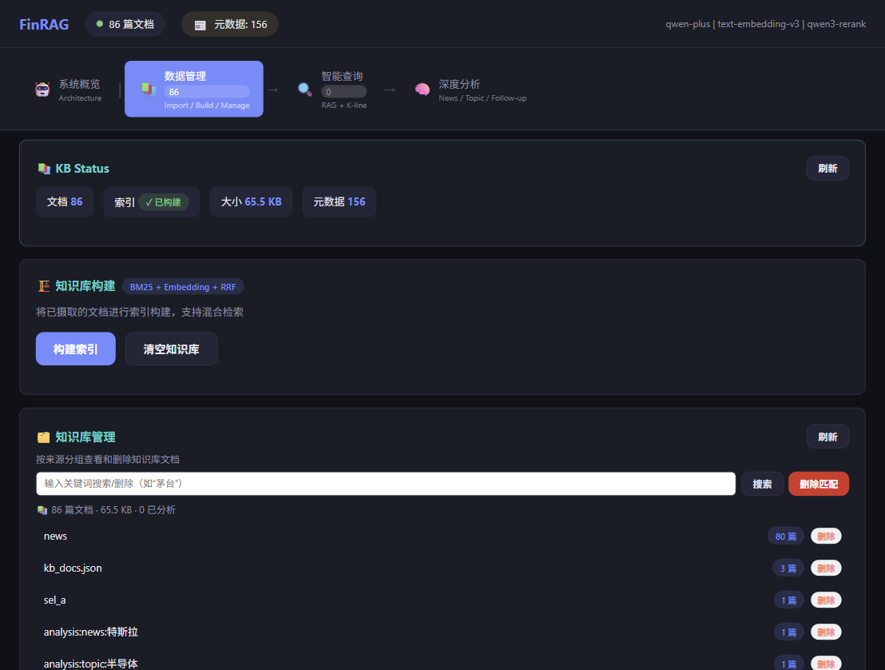

# FinRAG — Intent-Aware Multi-Agent RAG System

**Not all queries are equal.** A stock price question needs K-line data. A breaking-news question needs event impact scoring. An earnings question needs report synthesis. FinRAG routes each query to the right agent chain automatically — no manual pipeline selection.


> [Architecture Docs](docs/ARCHITECTURE.md) · [User Guide (中文)](USER_GUIDE.md) · [Interview Q&A (中文)](docs/PROJECT_QA.md)

---

<p align="center">
  
  <em>4-agent chain: Coordinator → Ingestion → Analysis → Scoring, with intent-based routing</em>
</p>

<p align="center">
  
  <em>RAG retrieval with hybrid search + K-line technical analysis in one unified query panel</em>
</p>

<p align="center">
  
  <em>Knowledge base management: import files, build indexes (BM25 + Embedding + RRF), search and delete by keyword</em>
</p>

---

## What Makes This Different

**Intent-aware routing.** The same word "Apple" routes to K-line analysis for stock price queries, event impact scoring for acquisition news, or report synthesis for earnings data — decided by the Coordinator agent, not the user.

**Agents don't do work — tools do.** Every agent is a lightweight orchestrator that only calls `self.call_tool()`. All business logic, API calls, and computation live in 27 registered tools across 9 modules. Agents stay thin and testable.

**Every chain ends with a quality gate.** The Scoring agent runs a 4-layer hallucination check (source grounding, numerical fidelity, citation integrity, structure compliance) and pipeline quality evaluation before any result reaches the user. No silent failures.

**Hybrid retrieval that actually works.** BM25 + ChromaDB ANN vector search (1024-dim) + RRF fusion + qwen3-rerank reranking + metadata filtering — five signals combined instead of relying on any single one.

**LLM calls never fail silently.** `LLMCaller` wraps every LLM invocation with retry, balanced-bracket JSON parsing, response caching, and anti-hallucination constraints — one unified layer for the entire system.

**507 tests, zero API keys.** All tests pass in under 5 seconds using mocked data sources. LLM and embedding stay real in tests — only external APIs are mocked.

---

## Architecture

```
┌──────────────────────────────────────────────────────────────┐
│  User Layer — FastAPI web UI (dark theme) + CLI             │
└────────────────────────────┬─────────────────────────────────┘
                             │
┌────────────────────────────▼─────────────────────────────────┐
│  Scheduling — AgentRouter (intent → chain)                  │
│               PipelineScheduler (5-phase execution)          │
└────────────────────────────┬─────────────────────────────────┘
                             │
┌────────────────────────────▼─────────────────────────────────┐
│  Agents (4)                                                  │
│  Coordinator  → classifies intent, selects agent chain       │
│  Ingestion    → fetches and indexes source documents         │
│  Analysis     → routes to tools by intent, assembles result  │
│  Scoring      → hallucination guard + quality evaluation     │
└────────────────────────────┬─────────────────────────────────┘
                             │
┌──────────┬─────────────────┬─────────────────────────────────┐
│ Retrieval│ Data APIs       │ LLM Layer                        │
│ BM25+Chroma│ Tushare         │ LLMCaller (retry+cache+JSON)    │
│ RRF+Rerank│ 10jqka/Eastmoney│ ModelRouter (4 tiers, Qwen)    │
└──────────┴─────────────────┴─────────────────────────────────┘
```

---

## How Routing Works

The Coordinator agent classifies each query into one of five intents, then the scheduler assembles the appropriate agent chain:

| Intent | Example Query | Chain |
|--------|---------------|-------|
| K-line analysis | "Show me the MACD for 600519" | Analysis → Scoring |
| Event impact | "Is this acquisition good or bad?" | Analysis → Scoring |
| Report synthesis | "Summarize Q4 earnings" | Ingestion → Analysis → Scoring |
| News deep-dive | "What happened in AI this week?" | Ingestion → Analysis (deep) → Scoring |
| General | anything else | Ingestion → Analysis → Scoring |

The user types a natural language question. The system decides everything else.

---

## Tech Stack

| Layer | Technology |
|-------|-----------|
| LLM | DashScope Qwen (turbo / plus / max / 235b) |
| Embedding | text-embedding-v3 (1024-dim) |
| Rerank | qwen3-rerank (fallback to RRF score) |
| Backend | FastAPI + 4 async routers |
| Data APIs | Tushare, 10jqka, Sina, EastMoney |
| Retrieval | BM25 + ChromaDB (ANN) + RRF + TextChunker + QueryParser |
| Vector DB | ChromaDB (HNSW ANN, cosine distance, persistent storage) |
| Testing | pytest — 507 tests across 21 files |

---

## Quick Start

```bash
# 1. Clone and setup
git clone https://github.com/your-username/financial-rag.git
cd financial-rag

# 2. Create virtual environment
python -m venv myenv

# Activate
# Windows (PowerShell):
.\myenv\Scripts\Activate.ps1
# macOS/Linux:
source myenv/bin/activate

# 3. Install dependencies
pip install -r requirements.txt

# 4. Configure API key
cp .env.example .env
# Edit .env and fill in DASHSCOPE_API_KEY
https://github.com/ConardLi
# 5. Launch web UI
python -m financial_rag.main web
# Opens at http://127.0.0.1:8000 — dark theme, all capabilities accessible from sidebar

# 6. Or use CLI
python -m financial_rag.main pipeline "What happened in AI this week?"
python -m financial_rag.main pipeline "Show me MACD for 600519" -v
python -m financial_rag.main toolcall -l   # list all registered tools
```

---

## Testing

```bash
python -m pytest tests/ -v    # 507 tests, < 5s, no API key needed
```

Tests mock only **data sources** (Tushare, news APIs). LLM, embedding, and rerank stay real. Extraction tools have regex fallback for fully offline operation.

---

## Documentation

- **[Architecture Docs](docs/ARCHITECTURE.md)** — system design, data flow, agent coordination
- **[User Guide (中文)](USER_GUIDE.md)** — feature walkthrough and usage examples
- **[Interview Q&A (中文)](docs/PROJECT_QA.md)** — technical depth for interviews

---

## License

MIT
