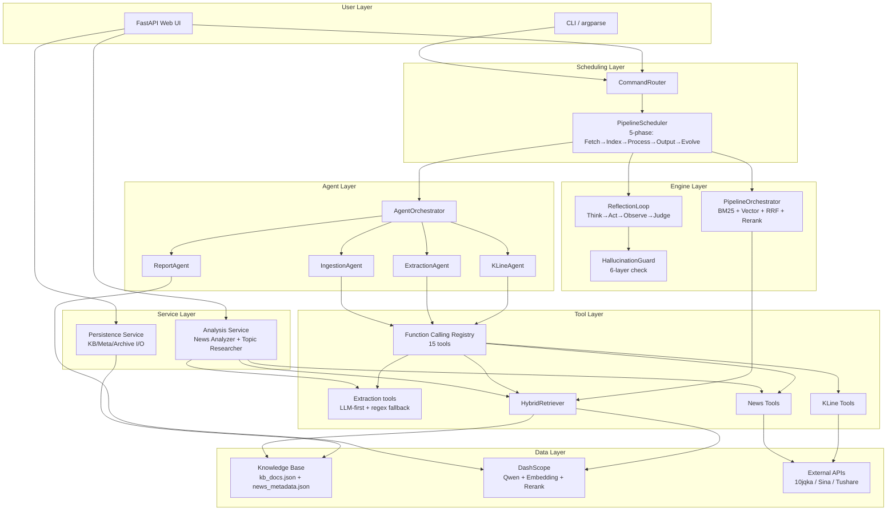
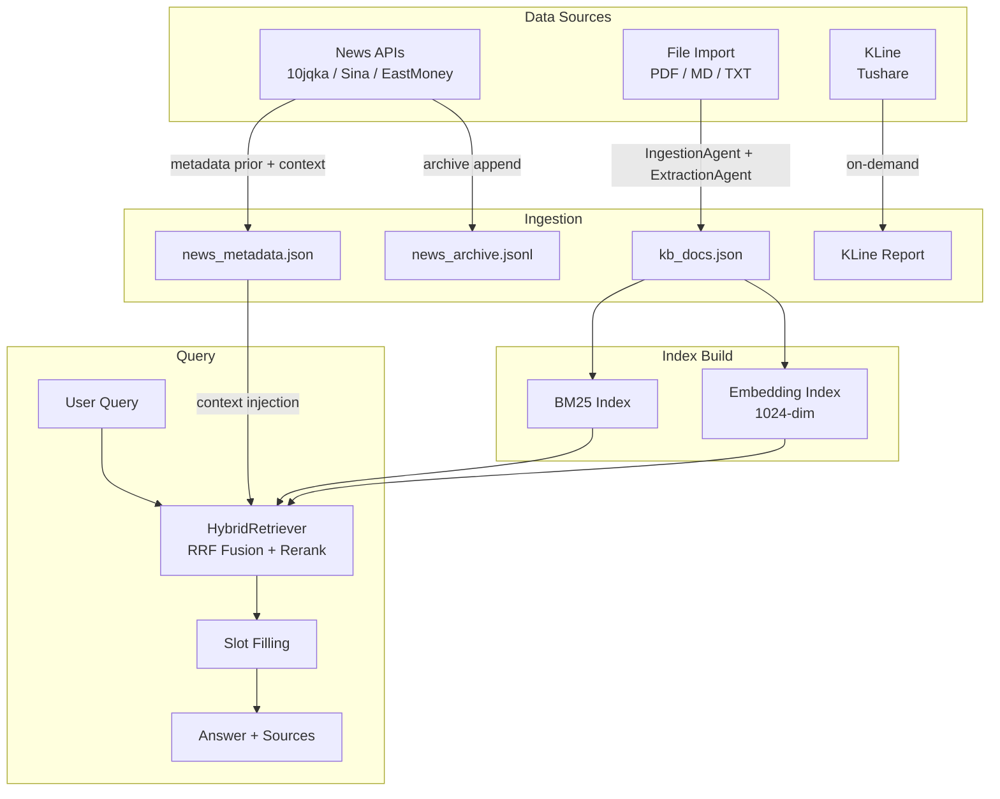
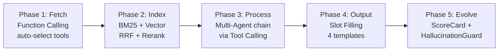
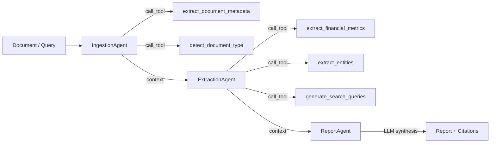
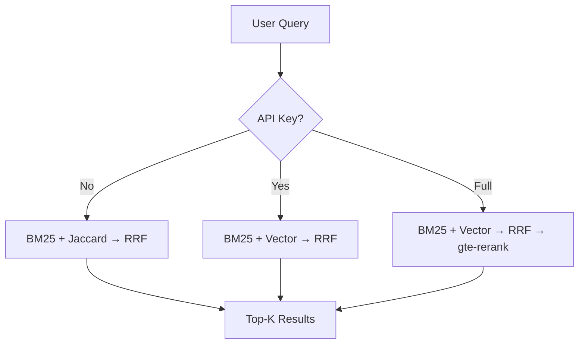

# Financial RAG — AI 板块智能分析 RAG Pipeline

面向 AI/科技行业的检索增强生成 (RAG) 系统。Multi-Agent 编排 + Function Calling 工具调用 + 混合检索 + 自评分反馈。基于阿里云 DashScope (Qwen)。

```
User Query → Data Fetch → RAG Index → Multi-Agent (via Tool Calling) → Slot-Filled Output → Score & Evolve
```

---

## Architecture Overview

Three core engines power the system. All are domain-agnostic and defined by abstract interfaces.



### Component Responsibilities

| Engine | File | Responsibility |
|--------|------|----------------|
| **Coordinate** | `core/orchestrator.py` | Register agents, decide execution order, pass context. 3 modes: SEQUENTIAL / PARALLEL / CONDITIONAL |
| **Indexer** | `core/indexer.py` | 4-stage retrieval: Clean → Extract → Retrieve → Verify. BM25+Vector + RRF fusion |
| **Reflection** | `core/reflector.py` | ReAct loop (Think→Act→Observe→Judge) + 6-layer anti-hallucination guard |

### Knowledge Base Lifecycle



| File | Purpose |
|------|--------|
| `data/knowledge_base/kb_docs.json` | Analyzed KB documents — loaded on server start, saved after file import with agent analysis |
| `data/knowledge_base/news_metadata.json` | News context labels — used as **parsing prior** and **query-time context** |
| `data/knowledge_base/news_archive.jsonl` | Cumulative raw news archive — each search appends with full metadata |
| `output/*.md` | Markdown reports (news summaries, K-line analysis reports) |

---

## 5-Phase Pipeline



### Agent Chain (Phase 3 detail)



Agents are **lightweight orchestrators** — all heavy work delegated to registered tools via Function Calling.

**AI 行业指标体系（ExtractionAgent）：**

| 类别 | 指标 |
|------|------|
| 财务 | revenue, net_income, gross_margin, rd_expense, arr |
| 算力 | gpu_count, training_cluster_size, inference_cost_per_token, compute_utilization |
| 模型 | model_params, context_window, inference_latency, benchmark_score |
| 商业 | api_calls, customer_count, dau, mau |

**实体抽取维度：** companies, persons, ai_models, chips_hardware, tech_terms, financial_figures, event, industries

### Retrieval Modes



| Mode | Condition | Chain |
|------|-----------|-------|
| Local only | No API Key | BM25 + Jaccard → RRF |
| With Embedding | API Key set | BM25 + Vector → RRF |
| Full pipeline | API Key active | BM25 + Vector → RRF → gte-rerank |

### Model Routing

| Tier | Model | Use case |
|------|-------|----------|
| LIGHT | qwen-turbo | Simple parsing, formatting |
| STANDARD | qwen-plus | Extraction, classification |
| HEAVY | qwen-max | Multi-step reasoning, trend analysis |
| ULTRA | qwen3-235b | Comprehensive analysis, report generation |

---

## File-by-File Guide

### Root

| File | Role |
|------|------|
| `main.py` | Thin wrapper — delegates to `financial_rag.main.main()` |
| `config.py` → `financial_rag/config.py` | All settings: LLM, RAG, Coordinator, Pipeline, Reflection, MCP |
| `.env.example` | Env var template (`DASHSCOPE_API_KEY`, `TUSHARE_TOKEN`) |
| `requirements.txt` | pip dependencies (incl. fastapi, uvicorn) |

### `financial_rag/` — Core Package

| File | Role | Key exports |
|------|------|-------------|
| `__init__.py` | Package entry, version `2.0.0` | Re-exports all public APIs |
| `main.py` | CLI entry (argparse) | `main()` |
| `config.py` | Global config dataclasses | `config`, `AppConfig`, `LLMConfig`, `RAGConfig`, `MCPConfig` |
| `prompts.py` | AI 行业 LLM prompt 模板 + few-shot 示例（商汤/英伟达/智谱AI） | — |
| `templates.py` | 4 slot templates: QUICK_QA, FINANCIAL_REPORT, NEWS_BRIEF, DEEP_ANALYSIS | `SlottedTemplate`, `ALL_TEMPLATES` |
| `slot_filler.py` | Parallel slot filling engine with TTFT measurement | `SlotFiller`, `create_slot_filler` |
| `rss_fetcher.py` | Financial news via domestic APIs (10jqka/Sina/EastMoney) + feedparser fallback | `search_news`, `fetch_all_news` |
| `tushare_client.py` | K-line & financial indicators via Tushare Pro | `fetch_stock_kline`, `compute_technical_indicators` |
| `web.py` | FastAPI Web UI server — thin shell, delegates to services/ | FastAPI app, `/api/*` endpoints |

### `financial_rag/services/` — Business Logic Layer

| File | Role | Key exports |
|------|------|-------------|
| `analysis.py` | Pure analysis functions (no HTTP deps, DI via kwargs) | `analyze_news_text()`, `analyze_topic_research()` |
| `persistence.py` | KB/Meta/Archive JSON read/write | `load_kb()`, `save_kb()`, `load_meta()`, `save_meta()`, `append_news_archive()` |

### `financial_rag/core/` — Architecture Layer

| File | Role | Key exports |
|------|------|-------------|
| `base.py` | Abstract foundations | `BaseAgent`, `AgentContext`, `AgentResult`, `ExecutionMode` |
| `orchestrator.py` | Multi-Agent scheduling engine | `AgentOrchestrator`, `CoordinatorConfig` |
| `pipeline.py` | 5-phase PipelineScheduler (central dispatcher) | `PipelineScheduler`, `PipelineResult` |
| `router.py` | CLI command dispatch + all command handlers | `CommandRouter` |
| `factory.py` | Factory functions for component creation | `create_orchestrator`, `create_hybrid_retriever`, `setup_environment` |
| `indexer.py` | Hybrid retrieval pipeline (Clean→Extract→Retrieve→Verify) | `PipelineOrchestrator`, `PipelineConfig` |
| `reflector.py` | ReAct loop + 6-layer HallucinationGuard | `ReflectionLoop`, `HallucinationGuard` |
| `scorer.py` | Full-pipeline scorecard (per-stage scoring + diagnosis) | `PipelineScoreCard`, `ScoreGrade` |
| `protocol.py` | Agent messaging: AgentMessage + MessageBus + MessageAdapter | `AgentMessage`, `MessageBus` |

### `financial_rag/agents/` — 4 Agents + Shared Utils

| File | Role |
|------|------|
| `ingestion_agent.py` | Data ingestion: load files/text → clean + call_tool(extract_document_metadata, detect_document_type) |
| `extraction_agent.py` | Feature extraction: call_tool(metrics, entities, queries) — AI 行业 12 项指标 + 9 类实体 |
| `report_agent.py` | LLM-driven news synthesis: key findings + trend analysis + sentiment + source citations |
| `kline_agent.py` | K-line analysis: resolve stock/ETF code → fetch data → compute indicators → LLM interpretation |
| `utils.py` | Shared utilities: `build_news_context()` for formatting news metadata into LLM prompts |

### `financial_rag/llm/` — LLM Layer

| File | Role |
|------|------|
| `dashscope_client.py` | DashScope API wrapper: LLM + Embedding + Rerank |
| `model_router.py` | Auto-select model by task complexity + budget control |

### `financial_rag/tools/` — Function Calling Registry

| File | Role |
|------|------|
| `core.py` | Infrastructure: `FunctionDef`, `FunctionRegistry`, `ToolExecutor`, `ToolCallSession` |
| `extraction_tools.py` | **5 extraction tools** (LLM-first + regex fallback): metrics, entities, metadata, doc_type, queries |
| `news_tools.py` | Registered tool: fetch news → save as Markdown report |
| `kline_tools.py` | Registered tool: fetch stock/ETF K-line → save as analysis report |

### `financial_rag/mcp_client/` — MCP Integration

| File | Role |
|------|------|
| `client.py` | Generic MCP client (stdio transport) |
| `news_client.py` | china-stock-mcp news tool wrapper |

### `financial_rag/retrievers/`

| File | Role |
|------|------|
| `__init__.py` | `HybridRetriever`: BM25 + Vector + RRF fusion + Rerank |

### `financial_rag/data/`

| File | Role |
|------|------|
| `financial_news.jsonl` | Sample training data (3 news articles) |

### `data/knowledge_base/` — Persistent KB Storage

| File | Role |
|------|------|
| `kb_docs.json` | Analyzed KB documents — file imports go through IngestionAgent + ExtractionAgent before entry |
| `news_metadata.json` | News context labels — keyword, title, source, publish_time (used for query-time context injection, NOT indexed) |
| `news_archive.jsonl` | Cumulative raw news archive — appended on every news search |

---

## CLI Quick Reference

All commands run from project root `d:\llamaindex` with venv activated.

```bash
# Web UI (recommended for most users)
python -m financial_rag.main web                          # http://127.0.0.1:8000
python -m financial_rag.main web --host 0.0.0.0 --port 9000

# Unified Pipeline (CLI)
python -m financial_rag.main pipeline "商汤科技2024年营收增长"
python -m financial_rag.main pipeline "英伟达GPU算力布局" -t news -v
python -m financial_rag.main pipeline "大模型推理成本趋势" -t deep -o ./output

# Interactive query
python -m financial_rag.main query -i
python -m financial_rag.main query -q "智谱AI融资估值"

# Build knowledge base
python -m financial_rag.main build --dir ./data/financial

# Multi-Agent analysis
python -m financial_rag.main analyze ./report.pdf --parallel

# Function Calling
python -m financial_rag.main toolcall -l                          # list all tools
python -m financial_rag.main toolcall "商汤科技营收增长" -v        # single call
python -m financial_rag.main toolcall "对比分析" --multi-turn       # multi-turn

# Slot filling
python -m financial_rag.main slot "智谱AI融资分析" -t fin

# News fetching
python -m financial_rag.main news "AI大模型" -s                   # + LLM summary

# ETF/stock K-line
python -m financial_rag.main kline "人工智能ETF" --days 30 -s
python -m financial_rag.main kline "半导体ETF" --days 60 -s

# Retrieval scoring
python -m financial_rag.main score "商汤科技营收" -k 5
python -m financial_rag.main score "GPU算力" --json scores.json

# Demo
python -m financial_rag.main demo
```

Template options: `quick` (default) | `fin` | `news` | `deep`

---

## Configuration

All config in `financial_rag/config.py`. Global instance: `from financial_rag.config import config`.

| Section | Key params | Defaults |
|---------|-----------|----------|
| `config.llm` | model, embedding_model, rerank_model, temperature, max_tokens | qwen-plus, text-embedding-v3, gte-rerank, 0.0, 4096 |
| `config.coordinator` | execution_mode, max_parallel_agents, max_retries, timeout_seconds | sequential, 3, 2, 300 |
| `config.pipeline` | hybrid_top_k, rrf_k, bm25_weight, vector_weight, min_faithfulness | 10, 60, 0.3, 0.7, 0.7 |
| `config.rag` | vector_store_path, similarity_top_k, chunk_size, chunk_overlap | ./storage/..., 5, 512, 50 |
| `config.reflection` | max_retrievals, max_steps, min_confidence, hallucination_threshold | 3, 6, 0.6, 0.6 |
| `config.mcp` | enable_mcp, china_stock_mcp_dir, timeout | false, "", 30.0 |

Env vars (`.env`):

| Variable | Required | Description |
|----------|----------|-------------|
| `DASHSCOPE_API_KEY` | No | Alibaba DashScope API key. Without it, falls back to local-only mode. |
| `TUSHARE_TOKEN` | No | Tushare Pro API token. Required for K-line data. Needs 120+ points for `daily` endpoint. |

---

## Programming API

```python
# LLM call
from financial_rag.llm import get_llm
from financial_rag.config import config
llm = get_llm(api_key=config.llm.api_key, model="qwen-plus")
resp = llm.chat("分析商汤科技2024年营收增长")

# Hybrid retrieval
from financial_rag.retrievers import HybridRetriever
from financial_rag.llm import get_embedding, get_reranker
retriever = HybridRetriever(
    embedder=get_embedding(api_key=config.llm.api_key),
    reranker=get_reranker(api_key=config.llm.api_key),
)
retriever.index(docs)
results = retriever.search("商汤科技营收", top_k=5)

# Multi-Agent orchestration
from financial_rag.core import create_orchestrator
orch = create_orchestrator()
result = orch.execute("./data/financial/report.pdf")

# Function Calling
from financial_rag.tools import create_financial_registry, create_tool_session
registry = create_financial_registry()
session = create_tool_session(llm=get_llm(), registry=registry)
stats = session.run("商汤科技营收增长多少")

# Analysis service (pure functions, no HTTP)
from financial_rag.services.analysis import analyze_news_text, analyze_topic_research
result = analyze_news_text("商汤科技2024年营收50.3亿元，同比增长36.4%")
print(result["assessment"])  # bullish / bearish / neutral
topic = analyze_topic_research("DeepSeek", max_news=20)

# Model routing
from financial_rag.llm import ModelRouter
router = ModelRouter()
router.override("analysis_agent", "qwen-max")
```

---

## Debug Guide

| Problem | Where to look |
|---------|---------------|
| Agent not working | `core/orchestrator.py` `_apply_updates()` — check context passing. Set `config.coordinator.verbose = True`. |
| K-line fetch fails | Check `.env` has `TUSHARE_TOKEN`. Token needs 120+ points on tushare.pro. Test: `from financial_rag.tushare_client import fetch_stock_kline`. |
| News fetch fails | Test: `from financial_rag.rss_fetcher import fetch_all_news; fetch_all_news()`. Uses domestic APIs (10jqka/Sina/EastMoney). |
| Retrieval inaccurate | Run `python -m financial_rag.main score "query"`. Adjust `config.pipeline` weights. |
| LLM hallucination | Check `core/reflector.py` HallucinationGuard 6-layer scores. Lower `temperature` to 0. Raise `min_faithfulness`. |
| Model cost too high | Check `llm/model_router.py` BudgetConfig. Override non-critical agents to `qwen-turbo`. |
| Adding a new Agent | Inherit `BaseAgent` from `core/base.py`, implement `process()`, register in `core/factory.py:create_orchestrator()`. |

---

## Setup (Windows)

```powershell
cd d:\llamaindex
python -m venv myenv
.\myenv\Scripts\Activate.ps1
pip install -r requirements.txt
Copy-Item .env.example .env
# Edit .env, fill in DASHSCOPE_API_KEY and TUSHARE_TOKEN

# Verify
python -c "import tushare, httpx; print('tushare:', tushare.__version__, 'httpx:', httpx.__version__)"
python -c "from financial_rag.llm import get_llm; print('llm ok')"
```

| Issue | Fix |
|-------|-----|
| `UnicodeDecodeError: 'gbk'` | `set PYTHONUTF8=1` or use PowerShell |
| `Activate.ps1` blocked | `Set-ExecutionPolicy RemoteSigned -Scope CurrentUser` |
| `lxml` build fails | `pip install lxml --only-binary :all:` |
| Chinese output garbled | Use PowerShell instead of CMD |

---

## Web UI (FastAPI)

The recommended interface. Start with:

```bash
python -m financial_rag.main web
# → http://127.0.0.1:8000
```

The UI guides you through the KB pipeline:

| Step | Action | Result |
|------|--------|--------|
| 📥 **导入数据** | Browse directories, click "分析并导入", or fetch news | Files loaded into KB buffer + persisted to `kb_docs.json` |
| 🏗️ **构建知识库** | Click "构建索引" | BM25 index + 1024-dim embeddings built |
| 🔍 **RAG 查询** | Ask questions against your KB | Hybrid retrieval with source citations |
| 🧠 **智能分析** | Paste news for analysis, or input a topic for research | Extraction + KB context → bullish/bearish/neutral verdict |
| 🔧 **分析工具** | News search, K-line, slot fill, score diagnostic | Standalone analysis tools |

**Key features:**
- Directory browser shows all data sources with file counts and one-click import
- News search auto-saves to `news_archive.jsonl` and auto-ingests to KB
- KB persists across server restarts (loaded from `kb_docs.json` on start)
- Query results show retrieved sources with scores, retriever types, and source tags

**API endpoints:**

| Endpoint | Method | Purpose |
|----------|--------|--------|
| `/api/config` | GET | Server config (models, API key status) |
| `/api/directories` | GET | Scan data directories with file listings |
| `/api/ingest/files` | POST | Load files from directory into KB |
| `/api/ingest/news` | POST | Fetch news and add to KB |
| `/api/ingest/sample` | POST | Load built-in sample data |
| `/api/build` | POST | Build BM25 + Embedding index |
| `/api/kb/status` | GET | KB stats (doc count, path, size, sources) |
| `/api/kb/clear` | POST | Clear KB from memory and disk |
| `/api/analyze/news` | POST | Paste news → extract + KB + bullish/bearish verdict |
| `/api/analyze/topic` | POST | Input topic → fetch news + KB + comprehensive verdict |
| `/api/kb-query` | POST | RAG query against built KB |
| `/api/news` | POST | News search (saves to archive + auto-ingests) |
| `/api/kline` | POST | Stock/ETF K-line analysis |
| `/api/slot` | POST | Slot filling test |
| `/api/pipeline` | POST | Full 5-phase pipeline |

---

## Testing

125 tests covering agents, extraction tools, analysis service, analysis tools, and mock data. No API key needed — all extraction tests run via regex fallback.

```bash
pip install pytest
python -m pytest tests/ -v
```

| Test file | Coverage | Tests |
|-----------|----------|-------|
| `test_extraction_tools.py` | 5 extraction tools (regex fallback) + long-article extraction | 34 |
| `test_agents.py` | IngestionAgent + ExtractionAgent + full chain (short + long text) | 22 |
| `test_analysis.py` | Analysis service: news analyze + topic research (mock mode) + helpers | 22 |
| `test_analysis_tools.py` | Growth rate, ratio, compare, summarize + registry/executor infra | 16 |
| `test_mock_data.py` | K-line, search, indicators, news + long-form AI articles | 31 |

**Mock data** (`mock_data.py`): Tushare + news API mocks for offline dev. `MOCK_MODE=true` in `.env` enables mock data sources while keeping LLM/embedding/rerank real.

**Long-form test articles** (3 articles, 900-1800 chars each):
- 商汤科技 2024 年报深度解读
- 英伟达 Blackwell 架构全面解析
- 2024 年中国 AI 大模型行业融资盘点

---

## License

MIT

---

## 领域说明

本系统聚焦 **AI/科技行业**，Prompt 模板、指标体系、实体类型、Few-shot 示例、文档分类均针对 AI 行业优化：

- **文档类型**：年报、季报、公告、政策文件、新闻报道、研究报告、技术报告、产品发布、融资公告、行业分析、其他（共 11 种）
- **指标体系**：财务 + 算力 + 模型 + 商业 四大类 12 项核心指标
- **实体维度**：公司、人物、AI模型、芯片硬件、技术术语、金额、事件、行业、主题
- **抽取策略**：LLM-first（高置信度结构化输出）+ regex-fallback（确定性高的字段兜底）
