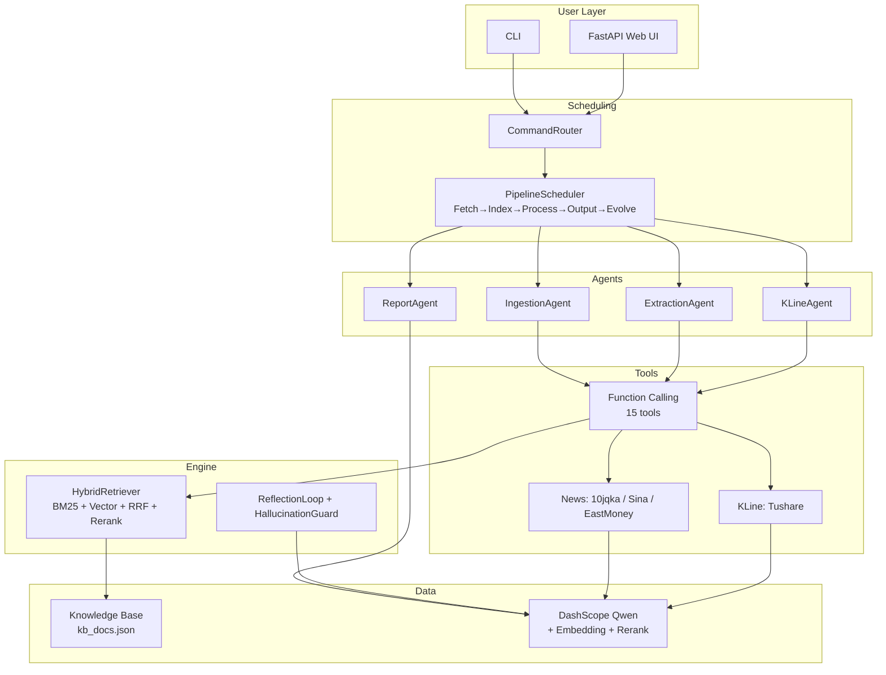

# Financial RAG — AI 板块智能分析系统

面向 AI/科技行业的检索增强生成 (RAG) 系统。**Multi-Agent 编排 + Function Calling + 混合检索 + 自评分反馈**，基于阿里云 DashScope (Qwen)。

> 📖 Detailed architecture docs: [docs/ARCHITECTURE.md](docs/ARCHITECTURE.md)

---

## Key Features

- **Multi-Agent Pipeline** — 5-phase flow: Fetch → Index → Process → Output → Evolve
- **Function Calling Architecture** — 15 registered tools, agents are lightweight decision-makers
- **Hybrid Retrieval** — BM25 + 1024-dim Vector + RRF fusion + Rerank
- **4 Specialized Agents** — Ingestion, Extraction, Report, KLine (all via tool calling)
- **LLM-Optional Design** — Heuristic fallback when no API key; mock mode for data sources
- **125 Unit Tests** — All pass in <0.1s, no API key needed

---

## Architecture



---

## Tech Stack

| Layer | Technology |
|-------|-----------|
| LLM | Alibaba DashScope (Qwen family: turbo/plus/max/235b) |
| Embedding | text-embedding-v3 (1024-dim) |
| Rerank | gte-rerank |
| Backend | FastAPI + Uvicorn |
| Frontend | Vanilla HTML/CSS/JS (dark theme) |
| Data APIs | 10jqka, Sina Finance, EastMoney, Tushare Pro |
| Retrieval | Custom BM25 + Vector + RRF fusion |
| Testing | pytest (125 tests, regex-fallback for offline) |

---

## Quick Start

```bash
# 1. Setup
python -m venv myenv && source myenv/bin/activate  # or .\myenv\Scripts\Activate.ps1 on Windows
pip install -r requirements.txt
cp .env.example .env  # fill DASHSCOPE_API_KEY (optional)

# 2. Launch Web UI
python -m financial_rag.main
# → http://127.0.0.1:8000

# 3. Or run CLI
python -m financial_rag.main pipeline "商汤科技2024年营收增长"
python -m financial_rag.main toolcall -l  # list all 15 tools
```

### Web UI Workflow

| Step | Action |
|------|--------|
| 📥 Import | Browse directories → analyze & import files, or fetch news |
| 🏗️ Build | Build BM25 + Embedding index from KB documents |
| 🔍 Query | Hybrid retrieval with source citations and scores |
| 🧠 Analyze | Paste news → structured extraction + bullish/bearish verdict |
| 🔧 Tools | News search, K-line analysis, slot filling, scoring |

---

## Mock Mode

Set `MOCK_MODE=true` in `.env` to use simulated data sources for offline development.

- **Mocked**: Tushare K-line data, News API results (25 AI-sector articles + 3 long-form)
- **Always real**: LLM, Embedding, Rerank (when API key is set)

A visible orange badge appears in the Web UI when mock mode is active.

---

## Testing

```bash
python -m pytest tests/ -v
```

| Test file | Coverage | Tests |
|-----------|----------|-------|
| `test_extraction_tools.py` | 5 extraction tools (regex fallback) + long-article | 34 |
| `test_agents.py` | IngestionAgent + ExtractionAgent + full chain | 22 |
| `test_analysis.py` | News analyze + topic research (mock mode) | 22 |
| `test_analysis_tools.py` | Growth rate, ratio, compare, summarize | 16 |
| `test_mock_data.py` | K-line, search, indicators, news + long-form | 31 |

---

## Domain Focus

本系统聚焦 **AI/科技行业**：

- **11 种文档类型** — 年报、季报、公告、政策、新闻、研报、技术报告、产品发布、融资公告、行业分析、其他
- **12 项核心指标** — 财务(revenue, net_income) + 算力(gpu_count, inference_cost) + 模型(params, latency) + 商业(api_calls, dau)
- **9 类实体维度** — 公司、人物、AI模型、芯片、技术术语、金额、事件、行业、主题

---

## Project Structure

```
financial_rag/
├── agents/          # 4 specialized agents (all via function calling)
├── core/            # Architecture: orchestrator, pipeline, retriever, scorer
├── llm/             # DashScope client + model router
├── services/        # Business logic (analysis, persistence)
├── tools/           # 15 registered tools (extraction, news, kline)
├── static/          # Frontend (HTML/CSS/JS)
├── retrievers/      # HybridRetriever: BM25 + Vector + RRF
├── config.py        # All configuration
├── web.py           # FastAPI endpoints
└── main.py          # CLI entry
```

---

## License

MIT
