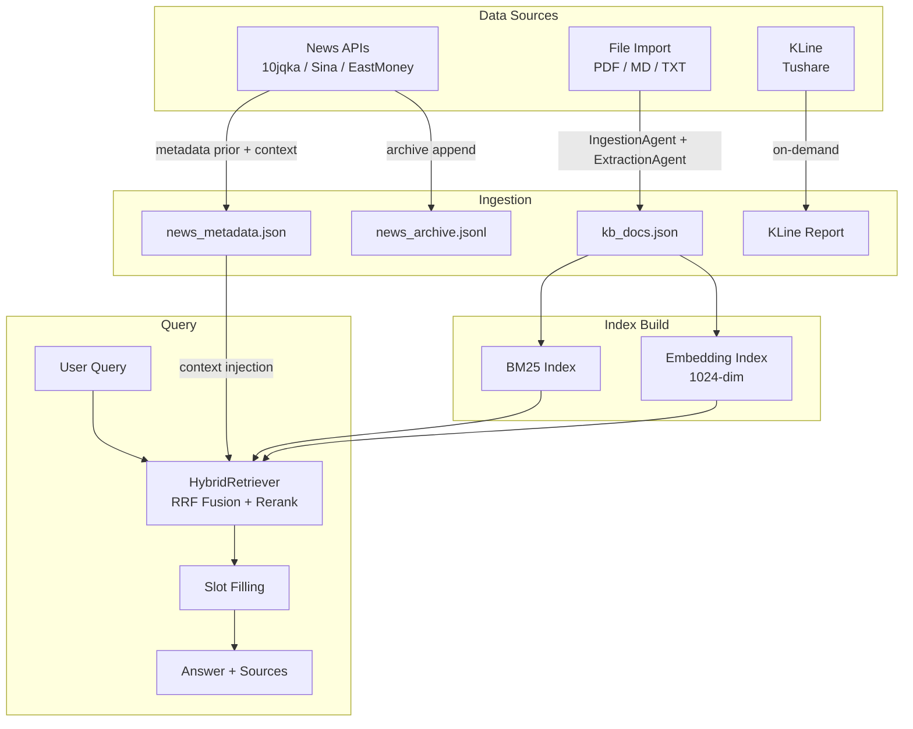
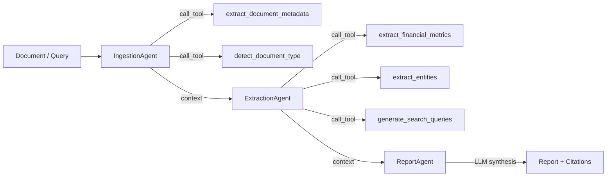
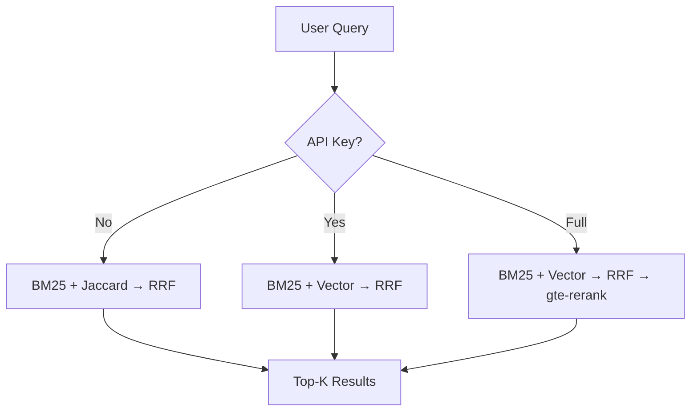

# Architecture Deep Dive

> This document provides detailed architecture documentation. See [README.md](../README.md) for project overview and quick start.

## Component Responsibilities

| Engine | File | Responsibility |
|--------|------|----------------|
| **Coordinate** | `core/orchestrator.py` | Register agents, decide execution order, pass context. 3 modes: SEQUENTIAL / PARALLEL / CONDITIONAL |
| **Indexer** | `core/indexer.py` | 4-stage retrieval: Clean → Extract → Retrieve → Verify. BM25+Vector + RRF fusion |
| **Reflection** | `core/reflector.py` | ReAct loop (Think→Act→Observe→Judge) + 6-layer anti-hallucination guard |

## Knowledge Base Lifecycle



| File | Purpose |
|------|--------|
| `data/knowledge_base/kb_docs.json` | Analyzed KB documents — loaded on server start, saved after file import with agent analysis |
| `data/knowledge_base/news_metadata.json` | News context labels — used as **parsing prior** and **query-time context** |
| `data/knowledge_base/news_archive.jsonl` | Cumulative raw news archive — each search appends with full metadata |
| `output/*.md` | Markdown reports (news summaries, K-line analysis reports) |

---

## Agent Chain (Phase 3 Detail)



Agents are **lightweight orchestrators** — all heavy work delegated to registered tools via Function Calling.

### AI 行业指标体系（ExtractionAgent）

| 类别 | 指标 |
|------|------|
| 财务 | revenue, net_income, gross_margin, rd_expense, arr |
| 算力 | gpu_count, training_cluster_size, inference_cost_per_token, compute_utilization |
| 模型 | model_params, context_window, inference_latency, benchmark_score |
| 商业 | api_calls, customer_count, dau, mau |

**实体抽取维度：** companies, persons, ai_models, chips_hardware, tech_terms, financial_figures, event, industries

---

## Retrieval Modes



| Mode | Condition | Chain |
|------|-----------|-------|
| Local only | No API Key | BM25 + Jaccard → RRF |
| With Embedding | API Key set | BM25 + Vector → RRF |
| Full pipeline | API Key active | BM25 + Vector → RRF → gte-rerank |

---

## Model Routing

| Tier | Model | Use case |
|------|-------|----------|
| LIGHT | qwen-turbo | Simple parsing, formatting |
| STANDARD | qwen-plus | Extraction, classification |
| HEAVY | qwen-max | Multi-step reasoning, trend analysis |
| ULTRA | qwen3-235b | Comprehensive analysis, report generation |

---

## File-by-File Guide

### Root

| File | Role |
|------|------|
| `main.py` | Thin wrapper — delegates to `financial_rag.main.main()` |
| `config.py` → `financial_rag/config.py` | All settings: LLM, RAG, Coordinator, Pipeline, Reflection |
| `.env.example` | Env var template (`DASHSCOPE_API_KEY`, `TUSHARE_TOKEN`) |
| `requirements.txt` | pip dependencies (incl. fastapi, uvicorn) |

### `financial_rag/` — Core Package

| File | Role | Key exports |
|------|------|-------------|
| `__init__.py` | Package entry, version `2.0.0` | Re-exports all public APIs |
| `main.py` | CLI entry (argparse) | `main()` |
| `config.py` | Global config dataclasses | `config`, `AppConfig`, `LLMConfig` |
| `prompts.py` | AI 行业 LLM prompt 模板 + few-shot 示例（商汤/英伟达/智谱AI） | — |
| `templates.py` | 4 slot templates: QUICK_QA, FINANCIAL_REPORT, NEWS_BRIEF, DEEP_ANALYSIS | `SlottedTemplate`, `ALL_TEMPLATES` |
| `slot_filler.py` | Parallel slot filling engine with TTFT measurement | `SlotFiller`, `create_slot_filler` |
| `rss_fetcher.py` | Financial news via domestic APIs (10jqka/Sina/EastMoney) | `search_news`, `fetch_all_news` |
| `tushare_client.py` | K-line & financial indicators via Tushare Pro | `fetch_stock_kline`, `compute_technical_indicators` |
| `mock_data.py` | 25 AI-sector mock news + 3 long-form articles | Mock data for offline dev |
| `web.py` | FastAPI Web UI server — thin shell, delegates to services/ | FastAPI app, `/api/*` endpoints |

### `financial_rag/services/` — Business Logic Layer

| File | Role | Key exports |
|------|------|-------------|
| `analysis.py` | Pure analysis functions (no HTTP deps, DI via kwargs) | `analyze_news_text()`, `analyze_topic_research()` |
| `persistence.py` | KB/Meta/Archive JSON read/write | `load_kb()`, `save_kb()`, `load_meta()`, `save_meta()`, `append_news_archive()` |

### `financial_rag/core/` — Architecture Layer

| File | Role | Key exports |
|------|------|-------------|
| `base.py` | Abstract foundations | `BaseAgent`, `AgentContext`, `AgentResult`, `ExecutionMode` |
| `orchestrator.py` | Multi-Agent scheduling engine | `AgentOrchestrator` |
| `pipeline.py` | 5-phase PipelineScheduler | `PipelineScheduler`, `PipelineResult` |
| `router.py` | CLI command dispatch + handlers | `CommandRouter` |
| `factory.py` | Factory functions | `create_orchestrator`, `setup_environment` |
| `indexer.py` | Hybrid retrieval pipeline | `PipelineOrchestrator` |
| `reflector.py` | ReAct loop + HallucinationGuard | `ReflectionLoop`, `HallucinationGuard` |
| `scorer.py` | Full-pipeline scorecard | `PipelineScoreCard`, `ScoreGrade` |
| `protocol.py` | Agent messaging | `AgentMessage`, `MessageBus` |

### `financial_rag/agents/` — 4 Agents

| File | Role |
|------|------|
| `ingestion_agent.py` | Data ingestion → call_tool(extract_document_metadata, detect_document_type) |
| `extraction_agent.py` | Feature extraction → call_tool(metrics, entities, queries) — AI 行业 12 项指标 + 9 类实体 |
| `report_agent.py` | LLM-driven news synthesis: key findings + trend analysis + sentiment + citations |
| `kline_agent.py` | K-line analysis: resolve code → fetch → compute indicators → LLM interpretation |
| `utils.py` | Shared: `build_news_context()` |

### `financial_rag/llm/` — LLM Layer

| File | Role |
|------|------|
| `dashscope_client.py` | DashScope API: LLM + Embedding + Rerank |
| `model_router.py` | Auto-select model by task complexity + budget control |

### `financial_rag/tools/` — Function Calling Registry

| File | Role |
|------|------|
| `core.py` | Infrastructure: `FunctionDef`, `FunctionRegistry`, `ToolExecutor`, `ToolCallSession` |
| `extraction_tools.py` | 5 extraction tools (LLM-first + regex fallback) |
| `news_tools.py` | Fetch news → save as Markdown report |
| `kline_tools.py` | Fetch K-line → save as analysis report |

### `financial_rag/static/` — Frontend

| File | Role |
|------|------|
| `index.html` | Web UI structure |
| `styles.css` | Dark theme styling |
| `app.js` | Frontend logic + API interaction |

---

## CLI Quick Reference

```bash
# Web UI (recommended)
python -m financial_rag.main web

# Pipeline
python -m financial_rag.main pipeline "商汤科技2024年营收增长"
python -m financial_rag.main pipeline "英伟达GPU算力布局" -t news -v

# Function Calling
python -m financial_rag.main toolcall -l                  # list all tools
python -m financial_rag.main toolcall "商汤科技营收增长" -v

# News / KLine / Slot / Score
python -m financial_rag.main news "AI大模型" -s
python -m financial_rag.main kline "人工智能ETF" --days 30 -s
python -m financial_rag.main slot "智谱AI融资分析" -t fin
python -m financial_rag.main score "商汤科技营收" -k 5
```

Template options: `quick` (default) | `fin` | `news` | `deep`

---

## Configuration

All config in `financial_rag/config.py`. Global instance: `from financial_rag.config import config`.

| Section | Key params | Defaults |
|---------|-----------|----------|
| `config.llm` | model, embedding_model, rerank_model, temperature | qwen-plus, text-embedding-v3, gte-rerank, 0.0 |
| `config.coordinator` | execution_mode, max_parallel_agents, max_retries | sequential, 3, 2 |
| `config.pipeline` | hybrid_top_k, rrf_k, bm25_weight, vector_weight | 10, 60, 0.3, 0.7 |
| `config.reflection` | max_retrievals, max_steps, min_confidence | 3, 6, 0.6 |

Env vars (`.env`):

| Variable | Required | Description |
|----------|----------|-------------|
| `DASHSCOPE_API_KEY` | No | Alibaba DashScope API key. Without it → local-only mode |
| `TUSHARE_TOKEN` | No | Tushare Pro API token. 120+ points for `daily` endpoint |
| `MOCK_MODE` | No | `true` → data sources return mock data (LLM always real) |

---

## Debug Guide

| Problem | Where to look |
|---------|---------------|
| Agent not working | `core/orchestrator.py` `_apply_updates()`. Set `verbose = True` |
| K-line fetch fails | Check `.env` has `TUSHARE_TOKEN` with 120+ points |
| News fetch fails | `from financial_rag.rss_fetcher import fetch_all_news; fetch_all_news()` |
| Retrieval inaccurate | `python -m financial_rag.main score "query"`. Adjust `config.pipeline` weights |
| LLM hallucination | Check `core/reflector.py` HallucinationGuard. Lower `temperature` |
| Adding a new Agent | Inherit `BaseAgent`, implement `process()`, register in `factory.py` |

---

## Programming API

```python
# LLM call
from financial_rag.llm import get_llm
llm = get_llm(api_key=config.llm.api_key, model="qwen-plus")
resp = llm.chat("分析商汤科技2024年营收增长")

# Hybrid retrieval
from financial_rag.retrievers import HybridRetriever
retriever = HybridRetriever(embedder=get_embedding(), reranker=get_reranker())
retriever.index(docs)
results = retriever.search("商汤科技营收", top_k=5)

# Function Calling
from financial_rag.tools import create_financial_registry, create_tool_session
registry = create_financial_registry()
session = create_tool_session(llm=get_llm(), registry=registry)
stats = session.run("商汤科技营收增长多少")

# Analysis service (pure functions)
from financial_rag.services.analysis import analyze_news_text, analyze_topic_research
result = analyze_news_text("商汤科技2024年营收50.3亿元，同比增长36.4%")
print(result["assessment"])  # bullish / bearish / neutral
```
